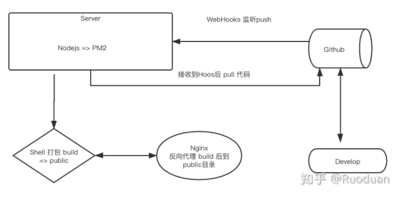
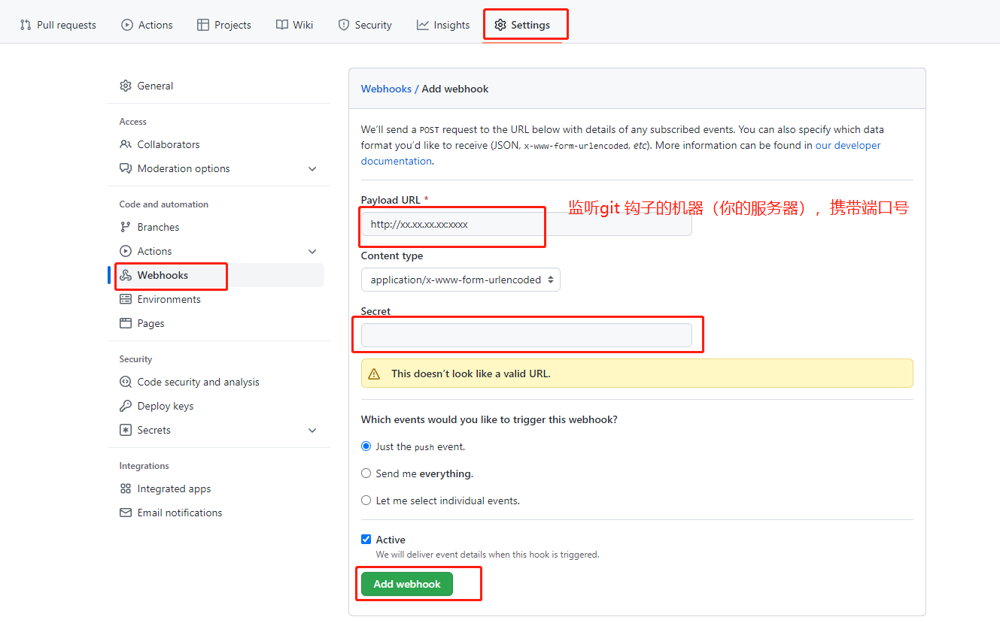

大致流程如下：




## 一、安装Node环境

见文章《Ubuntu服务器》


## 二、安装cpm

```bash
npm install -g cnpm@6.10.3 -registry=https://registry.npm.taobao.org
```

> 安装完成后输出：/root/tool/nodejs/node-v14.20.1-linux-x64/bin/cnpm -> /root/tool/nodejs/node-v14.20.1-linux-x64/lib/node_modules/cnpm/bin/cnpm

配置软链

```bash
# node12
ln -s /root/tool/nodejs/node-v12.10.0-linux-x64/bin/cnpm /usr/local/bin/cnpm
# node14
ln -s /root/tool/nodejs/node-v14.20.1-linux-x64/bin/cnpm /usr/local/bin/cnpm
```

npx配置软链

```bash
 # node12
 sudo ln -s /root/tool/nodejs/node-v12.10.0-linux-x64/bin/npx /usr/local/bin 
 # node 14
 sudo ln -s /root/tool/nodejs/node-v14.20.1-linux-x64/bin/npx /usr/local/bin
```


## 三、安装vue-cli

```bash
npm install -g @vue/cli
```

> 安装完成后输出：/root/tool/nodejs/node-v14.20.1-linux-x64/bin/vue -> /root/tool/nodejs/node-v14.20.1-linux-x64/lib/node_modules/@vue/cli/bin/vue.js

配置软链

```bash
# node12
ln -s /root/tool/nodejs/node-v12.10.0-linux-x64/bin/vue /usr/local/bin/
# node14
ln -s /root/tool/nodejs/node-v14.20.1-linux-x64/bin/vue /usr/local/bin/
```

执行 `vue -V` ，输出 `@vue/cli 5.0.8`，安装完成


## 四、安装docker-compose

安装 `docker` 见文章《Ubuntu服务器》

简介：Compose项目是Docker官方的开源项目，负责实现对Docker容器集群的快速编排。

一句话概括：如果好几个Docker想一起工作，就用 Compose


```bash
apt install docker-compose

# 试验一下是否安装成功
mkdir helloworld

vi docker-compose.yml

# 将下面代码弄进去
version: '3.1'
services:
  hello-world:
    image: hello-world

# 启动
docker-compose up
# 如果能打印出日志，说明没有问题，安装完毕
```


## 五、git配置

首先，需要去 `github` 上配置 `githook`：`git工程 => settings => Webhooks`

> 如果行不通，可以尝试 Content type 选 `application-json`




## 六、配置VSCode（上传代码使用）

```json
// .vscode/sftp.json
{
    "name": "AliyunServer",
    "host": "xx.xx.xx.xx",
    "port": 22,     
    "username": "root",
    "password": "xxxxxxxxxxx", 
    "protocol": "sftp", 
    "passive": false,
    "interactiveAuth": false,
    "remotePath": "/root/for-study-test/git-for-study",  // 上传地址（文件路径）
    "uploadOnSave": false, 
    "syncMode": "update",
    "ignore": [            
        "**/.vscode/**",
        "**/node_modules/**",
        "**/.DS_Store"
    ]
}
```


## 七、安装pm2

安装 github-webhook-handler 和 pm2

```bash
npm i github-webhook-handler pm2 -g
```

配置软链

```bash
ln -s /root/tool/nodejs/node-v14.20.1-linux-x64/bin/pm2 /usr/local/bin/
```


## 八、编写webhook服务


在项目根目录创建 `autobuild` 文件夹

```js
// autobuild/webhook.js
const http = require('http');
// github-webhook-handler 的绝对路径
const createHandler = require('/root/tool/nodejs/node-v14.20.1-linux-x64/lib/node_modules/github-webhook-handler');
// secret 保持和 GitHub 后台设置保持一致
const handler = createHandler({ path: '/', secret: 'dylanlv2022' });

function run_cmd(cmd, args, callback) {
  const spawn = require('child_process').spawn;
  const child = spawn(cmd, args);
  let resp = '';

  child.stdout.on('data', function(buffer) { resp += buffer.toString(); });
  child.stdout.on('end', function() { callback(resp); });
}

http.createServer(function(req, res) {
  handler(req, res, function(err) {
    res.statusCode = 404;
    res.end('no such location');
  });
}).listen(7777); // 启动服务的端口，需要开放安全组

handler.on('push', function(event) {
  console.log('Received a push event for %s to %s',
    event.payload.repository.name,
    event.payload.ref);
  run_cmd('sh', ['./webhook.sh', event.payload.repository.name], function(text) { console.log(text); });
});
```

> 注意：webhook服务的监听端口，就是 git 上 Webhooks 打开的端口。需要一致。


**编写shell脚本**

`autobuild/webhook.sh`

```bash
#!/bin/bash
WEB_PATH='/root/project/interview-blog'
DOCKER_COMPOSE_PATH='/root/project/interview-blog/autobuild'

echo "开始执行shell"
cd $WEB_PATH
echo "pulling source code..."
git pull &&
echo "changing permissions..."
#chown -R $WEB_USER:$WEB_USERGROUP $WEB_PATH
echo " git pull 完成. 开始 build"
npm run docs:build &&
echo "build 完成"
cd $DOCKER_COMPOSE_PATH
echo "开始重启docker-compose"
docker-compose down &&
docker-compose up -d
echo "docker-compose 重启完毕"
```


**`docker-compose` 配置**

```bash
// autobuild/docker-compose.yml
version: '3.1'
services:
  nginx:
    restart: always
    image: nginx
    ports:
      - 81:81
    volumes:
      - ./conf.d/:/etc/nginx/conf.d
      - /root/project/interview-blog/docs/.vuepress/dist:/usr/share/nginx/blog/
```

```bash
// autobuild/conf.d/docker.conf
server {
  listen  81;
  location / {
    root    /usr/share/nginx/blog;
    index   index.html index.htm;
    try_files $uri $uri/ /index.html;
  }
}
```


## 九、启动pm2服务

```bash
# 在此文件夹下：autobuild/ 
pm2 start webhook.js -o ./webhook.log
```


**安装依赖**

在项目根目录下执行命令`cnpm i`

**启动 `docker-compose`**

在 `autobuild` 文件夹下执行命令 `docker-compose up -d`


访问 `http://xx.xx.xx.xx:81/` 即可


