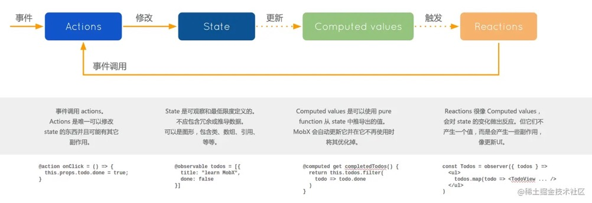

# React18中使用Mobx

​		`Mobx` 是一个基于响应式编程的状态管理库，`React` 和 `Mobx` 是一对强力组合，`React` 提供机制把应用状态转为**可渲染组件树**并对其进行渲染，而 `Mobx` 提供机制来**存储和更新应用的状态**供 `React` 使用。

​		`Mobx` 背后的哲学很简单：任何源自应用状态的东西都应该自动地获得，包括 **UI数据序列化**，服务器通讯等等。




## 1、核心概念

`Mobx` 的核心概念有三个：`State`（状态）、`Actions`（动作）、`Derivations`（派生）

### 1.1 定义可观察的 `State`

`Mobx` 通过 `observable` 标记一个可以被观察的状态并跟踪它们，只需要直接给他们赋值即可实现状态的修改

- 方法一：显示地标记 `observable` 和 `action`

```typescript
import { makeObservable, observable, action, computed } from "mobx"

export class Store {
  count: number = 0;
  price = 0;
  amount = 1;

  constructor() {
    makeObservable(this, {
      count: observable,
      price: observable,
      amount: observable,
      add: action,
    })
  }

  add() {
    this.count += 1;
  }
}
```

- 方法二：通过 `makeAutoObservable` 自动地给类中的每个属性和方法标记上 `observable` 和 `action`

```typescript
import { makeAutoObservable, observable, action, computed } from "mobx"

export class Store {
  count: number = 0;
  price = 0;
  amount = 1;

  constructor() {
    makeAutoObservable(this)
  }

  add() {
    this.count += 1;
  }
}
```


### 1.2 使用 `Action` 更新 `State`

​		`Action` 可以理解为任何可以改变 `State` 的代码，比如用户事件处理，后端推送数据处理等等。在上面的例子中， `add` 方法改变了 `count` 的属性值，而 `count` 是被标记为 `observale` 的，Mobx 推荐我们将所有修改 `observale` 的值的代码标记为 `action`


### 1.3 创建 `Derivations` 以便自动对 `State` 变化进行响应

> 任何来源是 `State` 且不需要进一步交互的东西都是 `Derivations`

Mobx 区分了两种 `Derivations`：

- `Computed`：计算属性，可以用纯函数的形式从当前可观测的 `State` 中派生
- `Reactions`：当 `State` 改变时，需要运行的副作用

> 注：副作用可以看成是响应式编程和命令式编程之间的桥梁。

- 通过 `computed` 对派生值进行建模

```typescript
import { makeAutoObservable } from "mobx"

export class Store {
  count: number = 0;
  price = 0;
  amount = 1;

  constructor() {
    makeAutoObservable(this)
  }

  add() {
    this.count += 1;
  }

  get total() {
    console.log('computed render')
    return this.price + this.amount
  }

  // computed可以有setter方法
  set total(value: number) {
    this.price = value;
  }
}
```


## 2. Mobx配合 `React Hooks` 创建全局状态管理

> 依赖包版本信息：React^18.0.0    React-DOM^18.0.0    Mobx^6.5.0    Mobx-React^7.3.0

- 安装 `Mobx`、`Mobx-React`

```bash
npm i mobx mobx-react
```


### 2.1 创建 Store

创建两个 `Store`，在构造器中使用 `makeAutoObservable()` 来给类中的属性和方法自动标记状态

```typescript
// /store/store.ts
import { makeAutoObservable } from "mobx"

export class Store {
  count: number = 0; // 这些属性会自动标记为 observable
  price = 0;
  amount = 1;

  constructor() {
    makeAutoObservable(this)
  }

  // 改变observable的方法，会被自动标记位action
  add() {
    this.count += 1;
  }

  // 使用get set的方法，会被自动标记为computed
  get total() {
    console.log('computed render')
    return this.price + this.amount
  }

  // computed可以有setter方法
  set total(value: number) {
    this.price = value;
  }
}
```

```typescript
// /store/user.ts
import { makeAutoObservable } from "mobx"

export class User {
  user: string = 'hayes lv';

  constructor() {
    makeAutoObservable(this);
  }

  set(name: string) {
    this.user = name;
  }
}
```

- 创建一个 `Store` 层的根目录，来实例化上面创建好的类

```typescript
// /store/index.ts
import { Store } from "./Store";
import { User } from "./user";

// 将每个 Store 实例化
export const RootStore = {
  store: new Store(),
  user: new User()
}
```


### 2.2 在项目入口使用 `Context` 共享全局的 `Store` 对象

```tsx
import { StrictMode } from "react";
import { createRoot } from "react-dom/client";
import Routers from "./routers";
import { Provider as MobxProvider } from "mobx-react";
import { RootStore } from "./store";

function App() {
  return (
    /* 使用MobX-React提供的Provider写入Store Context */
    <MobxProvider {...RootStore}>
      <Routers />
    </MobxProvider>
  );
}

createRoot(document.getElementById("root")!).render(
  <StrictMode>
    <App />
  </StrictMode>
);
```

到此为止，Mobx创建和全局挂载的步骤已经完成了，要在组件内的任何地方使用，我们只需要编写一个 `useStore` 的公用 `Hooks` 来取值即可


### 2.3 编写一个获取 `Store` 的公用 `Hooks`

因为上面使用了 `makeAutoObservable` API 来自动地标记类中的属性和方法，所以这里可以使用 `mobx-react` 提供的 `MobxProviderContext` 来获取已经创建好的 `Context`，再配合 `React` 的 `useContext`，即可实现状态的获取。

```tsx
// /hooks/useStore.ts
import { MobXProviderContext } from "mobx-react"
import { useContext } from "react"
import { RootStore } from "../store"

// 根据 RootStore 来实现参数的自动获取和返回值的自动推导
function useStore<T extends typeof RootStore, V extends keyof T>(name: V): T[V] {
  const store = useContext(MobXProviderContext) as T;
  return store[name]
}

export default useStore
```


### 2.4 在任意组件中使用

`Mobx` 要在组件中使用，首先要用 `observer` 包裹，将其变为响应式组件，然后使用我们刚才创建好的 `Hooks` 来获取指定的 `Store` 即可

```tsx
import { observer } from "mobx-react";
import useStore from "../hooks/useStore";

export default observer(() => {
  const store = useStore("store");
  
  return <div>
    {store.total}
    <button onClick={() => (store.total = 3)}>click</button>
  </div>
})
```


