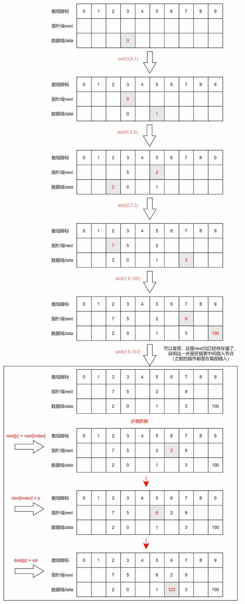

# 链表

1. 链表中的每个节点至少包含两个部分：数据域和指针域
2. 链表中的每个节点，通过指针域的值，形成i一个线性结构
3. 查找节点 O(n)，插入节点 O(1)，删除节点 O(1)
4. 不适合快速定位数据，适合动态的插入和删除数据的应用场景


## 一、简介

**链表**是一种物理存储单元上非连续、非顺序的存储结构，数据元素的逻辑顺序是通过链表中的指针链接次序实现的。链表由一系列结点（链表中每一个元素称为结点）组成，结点可以在运行时动态生成。每个结点包括两个部分：一个是存储数据元素的**数据域**，另一个是存储下一个结点地址的**指针域**。

- 抽象概念：链表代表了一种唯一指向思想。
- 链表适用于存储一些经常增加、删除的数据。


## 二、链表的创建

### 创建及遍历链表（使用 val & next 的方式）：

```js
class Node {
  constructor(val) {
    this.val = val;
    this.next = null;
  }
}
let head = new Node(null);
head.next = new Node(1);
head.next.next = new Node(2);
head.next.next.next = new Node(3);
head.next.next.next.next = new Node(4);
// 遍历链表
let p = head;
while(p) {
  console.log('->' + p.val);
  p = p.next;
}
```


### 创建及遍历链表Ⅱ（使用数组构造链表）：

```js
let data = []; // 数据域
let next = []; // 指针域
// 在index节点后面添加节点p，节点p的值是val
const add = (index, p, val) => {
  next[p] = next[index]; // 往链表中间插入数据时需要
  next[index] = p;
  data[p] = val;
  return;
}
// 构造链表
let head = 3; // 假设头节点的指针为3
data[3] = 0;
add(3, 5, 1);
add(5, 2, 2);
add(2, 7, 3);
add(7, 9, 100);
add(5, 6, 123);
// 访问链表
let p = head;
while(p) {
  console.log('->', data[p]);
  p = next[p];
}
```

图解如下：




## 三、链表的应用场景

1. 操作系统内的动态内存分配
2. LRU缓存淘汰算法（缓存：高速设备之于低速设备的一种称呼）


