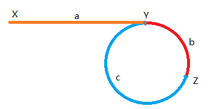

# leetcode142-环形链表Ⅱ（求入环点）

<a href="https://leetcode-cn.com/problems/linked-list-cycle-ii/" target="_blank">环形链表Ⅱ</a>

给定一个链表，返回链表开始入环的第一个节点。如果链表无环，则返回 `null`。

如果链表中有某个节点，可以通过连续跟踪 `next` 指针再次到达，则链表中存在环。为了表示给定链表中的环，评测系统内部使用整数 `pos` 来表示链表尾连接到链表中的位置（索引从 0 开始）。如果 `pos` 是 -1，则该链表中没有环。注意：`pos` 不作为参数进行传递，仅仅是为了标识链表的实际情况。

`不允许修改`链表

**思路：快慢指针**

1. 我们假设链表头到入环口的距离为 `a`，从入环口到相遇点的距离为 `b` ，从相遇点到入环口的距离为 `c`
2. 相遇时，`slow` 走了 `a+b`，`fast`走了 `a+b+(b+c)`，`fast` 又是2倍的 `slow`，于是 `2(a+b) = a+2b+c` 相当于 `a=c`
3. `Z`为快慢指针相遇点，因此当快慢指针相遇后，重新定义一个新指针从起始位置`X`向后移动，慢指针继续从 `Z` 向后移动。
4. 当新指针和慢指针相遇时，就是入环点。



**题解**

```js
var detectCycle = function(head) {
  if(!head || !head.next) return null;
  let slow = fast = start = head;
  do{
    slow = slow.next;
    // 先走一步，成功后再走一步，防止出现空指针
    (fast = fast.next) && (fast = fast.next);
  } while(fast && fast.next && (slow !== fast))
  
  if(slow !== fast) return null
  
  while(slow !== start) {
    slow = slow.next;
    start = start.next;
  }
  
  return slow;
}
```


