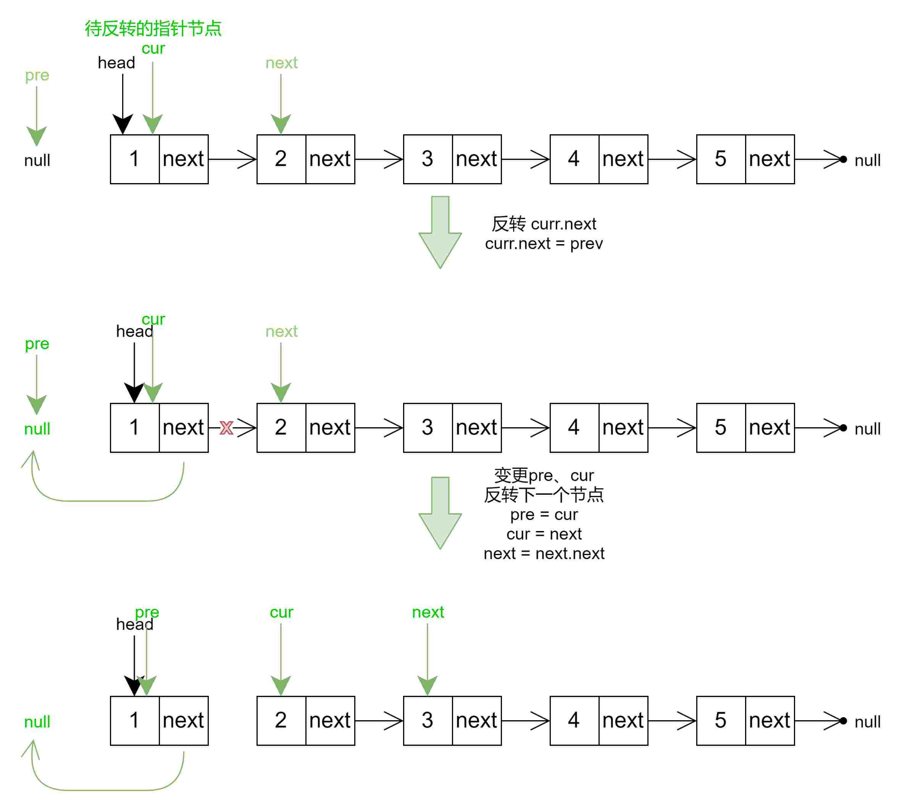
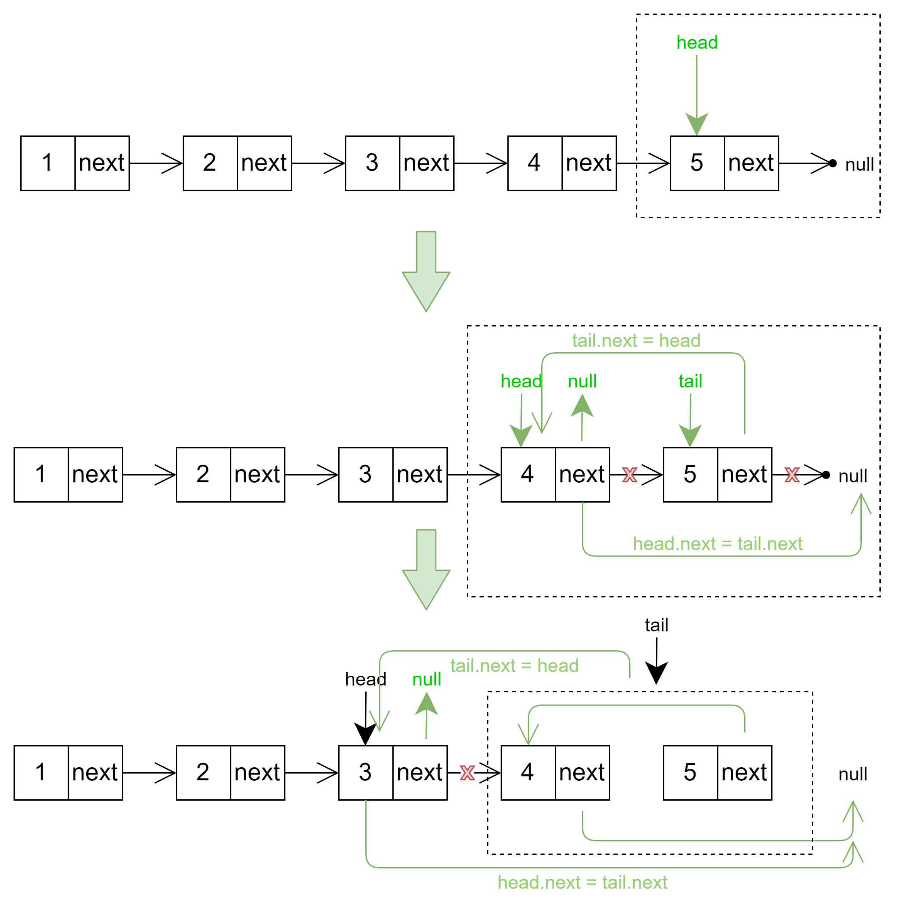

# leetcode206-反转链表

<a href="https://leetcode-cn.com/problems/reverse-linked-list/" target="_blank">反转链表</a>

给你单链表的头节点 `head` ，请你反转链表，并返回反转后的链表。

```js
输入：head = [1,2,3,4,5]
输出：[5,4,3,2,1]
```

**思路：**

1. 初始化：
   1. 定义指针---`pre`：pre指向空；
   2. 定义指针---`cur`，cur指向我们的头节点；
   3. 定义指针---`next`，next指向cur所指向节点的下一个节点。
2. 首先，我们将`cur`所指向的节点指向`pre`所指向的节点。
3. 然后移动指针`pre`到指针`cur`所在的位置，移动`cur`到`next`所在的位置。（此时，我们已经反转了第一个节点）
4. 将`next`指针指向`cur`指针所指向节点的下一个节点。然后重复上述操作。
5. 当`cur`指针指向`null`的时候，我们就完成了整个链表的反转。


**迭代法**

```js
var reverseList = function(head) {
    if(!head || !head.next) return head;
    let pre = null, cur = head, next = head.next;
    while(cur) {
        cur.next = pre;
        pre = cur;
        (cur = next) && (next = next.next);
    }
    return pre;
};
```

也可以使用解构赋值的写法

```js
var reverseList = function(head) {
    if(head === null) return head;
    let prev = null, cur = head;
    while(cur) {
        [cur.next, prev, cur] = [prev, cur, cur.next];
    }
    return prev;
};
```




**递归法**

```js
var reverseList = function(head) {
    if(!head || !head.next) return head;
    let tail = head.next;
    let p = reverseList(tail);
    head.next = tail.next;
    tail.next = head;
    return p;
};
```

