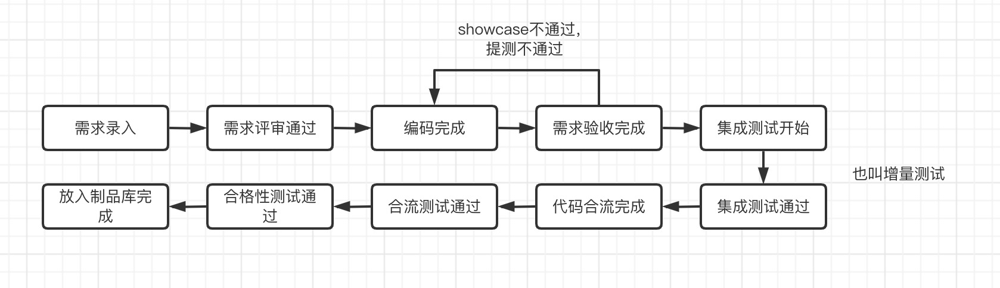

## 需求阶段

需求准备 => FT（业务侧）组内评审 => 产品内部评审 => leader评审 => 需求全员评审

## 设计阶段

交互设计 => 交互组内评审 => 交互全员评审 => 视觉设计 => 视觉组内评审 => 视觉全员评审

技术方案设计 => 技术方案评审 => 测试方案设计 => 测试用例设计 => 测试用例评审

## 排期阶段

研发工期预估 => 测试工期预估 => 研发排期 => 测试排期 => 项目排期

## 研发阶段

编码阶段 => 联调阶段 => 单元测试 => 研发自测

## 测试阶段

show case => 产品验收 => 集成测试 => 适配测试 => 性能测试 

代码合并 => 合格性测试 => 灰度测试 => 发版包测试

## 发布阶段

H5上线 => 后段上线 => 版本发布

# 流程流转

